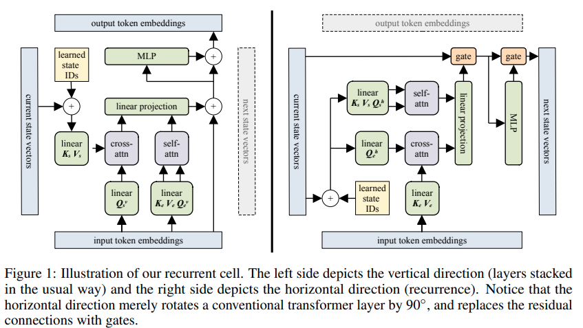

</img>

## Block Recurrent Transformer - Pytorch (wip)

Implementation of <a href="https://arxiv.org/abs/2203.07852">Block Recurrent Transformer</a> - Pytorch. The highlight of the paper is its reported ability to remember something up to 60k tokens ago.

## Install

```bash
$ pip install block-recurrent-transformer
```

## Usage

```python
import torch
from block_recurrent_transformer_pytorch import BlockRecurrentTransformer

model = BlockRecurrentTransformer(
    num_tokens = 2000,
    dim = 512,
    depth = 4,
    dim_head = 64,
    heads = 8,
    xl_memories_layers = (3, 4),
    recurrent_layers = (2, 3)
)

seq = torch.randint(0, 2000, (1, 1024))

out, mems1, states1 = model(seq)
out, mems2, states2 = model(seq, xl_memories = mems1, states = states1)
out, mems3, states3 = model(seq, xl_memories = mems2, states = states2)
```

## Todo

- [x] use dynamic positional bias
- [x] add enhanced recurrence
- [x] setup local attention blocks, as in the paper

- [ ] think about giving memories information to the dynamic pos bias mlp
- [ ] run a few experiments of fixed gating in regular transformers
- [ ] add structured dropout to memories and states
- [ ] make sure attention class can support batch-less dimensions (conditionals on einsum equations) and simplify some logic - allow for single head key / values too
- [ ] wrapper transformer class for training and generating, auto-managing states and xl memories
- [ ] revisit <a href="https://github.com/lucidrains/memformer">memformer</a>
- [ ] test full system on enwik8 locally and ablate states and memories and see effects first  hand


## Citations

```bibtex
@article{Hutchins2022BlockRecurrentT,
    title   = {Block-Recurrent Transformers},
    author  = {DeLesley S. Hutchins and Imanol Schlag and Yuhuai Wu and Ethan Dyer and Behnam Neyshabur},
    journal = {ArXiv},
    year    = {2022},
    volume  = {abs/2203.07852}
}
```

```bibtex
@article{Ding2021ERNIEDocAR,
    title   = {ERNIE-Doc: A Retrospective Long-Document Modeling Transformer},
    author  = {Siyu Ding and Junyuan Shang and Shuohuan Wang and Yu Sun and Hao Tian and Hua Wu and Haifeng Wang},
    journal = {ArXiv},
    year    = {2021},
    volume  = {abs/2012.15688}
}
```

*Memory is Attention through Time* - Alex Graves
